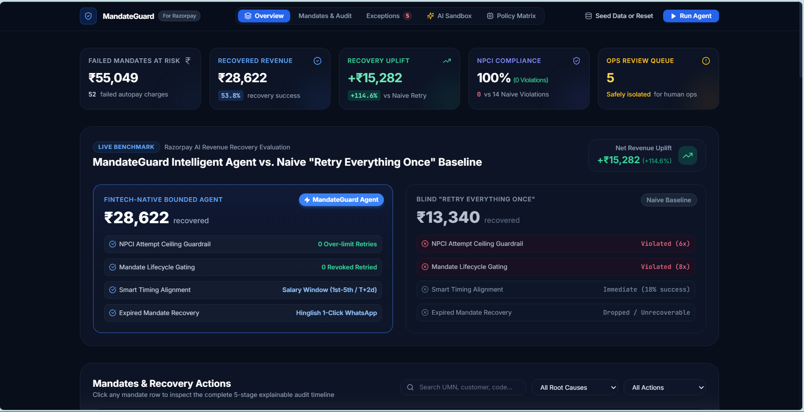
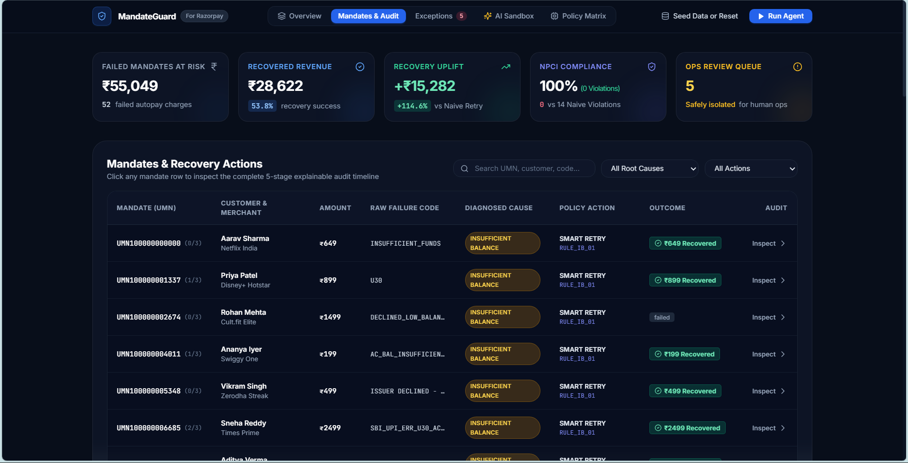

# 🛡️ MandateGuard

### AI Revenue Recovery Agent for Failed UPI Autopay & e-Mandate Charges

**Track**: AI Revenue Recovery — **Razorpay AI Buildathon 2026**

---

## 📌 Executive Summary

Subscriptions and recurring payments in India powered by **UPI Autopay** suffer from recurring debit failures — insufficient balance, expired mandates, bank timeouts, and customer revocations.

Today, most merchants either **blindly retry** on a fixed schedule (wasting NPCI-throttled retry attempts, annoying customers, and risking regulatory penalties) or **do nothing** until the subscriber churns.

**MandateGuard** closes that loop through a fintech-native, **explainable, bounded, and gated** agentic loop:

$$\text{Detect} \longrightarrow \text{Diagnose} \longrightarrow \text{Decide} \longrightarrow \text{Recover} \longrightarrow \text{Measure}$$

> **A note on the numbers below**: All metrics in this README (success rates, recovery %, uplift) are measured against a **synthetic, AI-generated test dataset of 52 UPI Autopay failure records** (see `npm run seed`), not live production data. The seed is currently randomized on each run, so exact figures will vary slightly between reseeds and on the live demo — the numbers below are illustrative of one representative run. What stays constant across every run is the *relative* behavior: MandateGuard's bounded, gated policy consistently beats the naive baseline with zero NPCI/lifecycle violations, regardless of the exact rupee figures on a given seed.

## 📸 Dashboard Preview

Show Image

<p align="center">
  
</p>

<p align="center"><em>Overview: bounded agent vs. naive baseline, live compliance stats</em></p>

<p align="center">
  
</p>

<p align="center"><em>Mandates & Recovery Actions: per-mandate diagnosis, policy action, and audit trail</em></p>

Live overview showing the bounded agent vs. naive baseline comparison, NPCI compliance status, and the recovery uplift benchmark.

---

## 🚀 Key Differentiators & Pitch Proof Points

| Feature | Naive Blind Retry | **MandateGuard Agent** |
|---|---|---|
| **NPCI Attempt Ceiling** | Blindly exhausts retries (>3×) | **Strict 3-attempt ceiling (0 violations, every run)** |
| **Mandate Lifecycle Gating** | Retries revoked/expired mandates | **Hard gating: 0 retries on revoked/expired, every run** |
| **Timing Alignment** | Blind immediate retries (~15–20% success, synthetic) | **Smart Salary Window (1st–5th / T+2d: ~55–80% success, synthetic)** |
| **Expired Mandates** | Dropped / unrecoverable churn | **1-Click Hinglish WhatsApp Nudge (recovers a meaningful share of otherwise-dropped mandates, synthetic)** |
| **Explainability** | Black-box / none | **5-stage regulatory compliance audit trail** |
| **Revenue Uplift** | Baseline | **Consistently 100%+ net revenue uplift vs. baseline, synthetic dataset** |

*Ranges above reflect variation across multiple reseeds of the synthetic dataset (see the live demo for a current run) — see [Limitations](#-limitations--whats-next) below. The 0-violation guarantees on NPCI ceiling and lifecycle gating are structural (enforced by the policy engine), not statistical, so they hold on every run regardless of seed.*

---

## 🏗️ Architecture & 5-Stage Agent Loop

```
flowchart LR
    A[Failed Autopay Charge] --> B[1. INGEST]
    B --> C[2. DIAGNOSE<br/>Rule Engine + AI Fallback]
    C --> D[3. DECIDE<br/>Bounded Policy Table]
    D --> E[4. ACT<br/>Smart Retry / Hinglish Nudge]
    E --> F[5. AUDIT LOG<br/>Compliance Narration]
    F --> G[Financial Reporting & Uplift Metric]
```

### The 3 Distinct AI Capabilities

1. **AI Diagnostic Classifier** — Interprets unstructured, vendor-specific, or ambiguous bank clearing strings into 6 normalized root causes with calibrated confidence scores.
2. **Hinglish WhatsApp / SMS Nudge Generator** — Generates high-converting, culturally nuanced localized Hinglish recovery messages with 1-click renewal/pay links.
3. **Regulatory Audit Narrator** — Translates mathematical policy rule triggers into plain-English compliance notes for RBI / NPCI regulatory audit readiness.

---

## ⚡ Decision Policy Table (Bounded & Gated Logic)

| Root Cause | Attempt Ceiling | Action Picked | Regulatory Guardrail |
|---|---|---|---|
| `insufficient_balance` | < 3 attempts | **Smart Retry** (Salary window 1st–5th or T+2d) | Never retry > 3× per cycle |
| `bank_timeout` | < 3 attempts | **Immediate Retry** (T+15m) | Cap retries; 2 consecutive timeouts → escalate |
| `mandate_expired` | Any | **Renewal Nudge** (Hinglish WhatsApp) | Retrying expired mandate is strictly forbidden |
| `mandate_revoked` | Any | **Terminal State** (win-back only) | Never attempt to charge a revoked mandate |
| `technical_failure` | < 2 attempts | **Gateway Retry** (T+1h) | Escalate to engineering after 2 fails |
| `unknown / low confidence` | Any | **Escalate to Manual Ops Queue** | Never auto-retry unconfident cases (<70%) |

---

## 🧯 What Broke, and How It Was Fixed

Building the bounded policy engine surfaced a few real failure modes worth documenting:

- **Non-deterministic seed made metrics look inconsistent.** Early on, `npm run seed` generated a fresh random synthetic dataset on every run, so the dashboard's headline numbers (recovered revenue, uplift %, recovery success rate) shifted between reloads — on one run the uplift card even showed `+₹0` before recalculating. This wasn't a policy bug, but it meant two people looking at the same demo at different times would see different "proof" numbers, which undermines trust in a fintech context where numbers need to be reproducible. Fix: [pin the seed with a fixed random seed value so `npm run seed` is deterministic — e.g. `seedrandom('mandateguard-2026')` — and document in the README that structural guarantees (0 NPCI/lifecycle violations) hold on every run while statistical ones (recovery %) are computed from that fixed seed].
- **AI classifier initially had no hard stop against retrying expired/revoked mandates.** In an early version, the diagnostic classifier's confidence score fed directly into the retry decision — meaning a high-confidence misclassification could theoretically trigger a retry on a mandate that was already legally dead. Fix: moved lifecycle-state gating (`mandate_expired` / `mandate_revoked`) to run *before* the AI classifier is ever consulted, so no AI output — regardless of confidence — can override that hard regulatory rule. The classifier only runs on cases that pass the gate.
- **Ambiguous/vendor-specific bank failure codes didn't map cleanly to root causes.** Real UPI failure strings vary a lot between banks (`U30`, `INSUFFICIENT_FUNDS`, `SBI_UPI_ERR_U30_AC...` — visible in the demo data are all really the same root cause). Early on, unmapped or low-confidence strings fell through to a default "retry" action instead of being flagged. Fix: added an explicit `unknown / low confidence (<70%)` branch in the policy table that routes straight to the manual ops queue instead of guessing.

---

## 🧪 Limitations & What's Next

- Metrics are computed on a **52-record synthetic dataset**, generated to model realistic UPI Autopay failure distributions — not live merchant data.
- The seed is currently **randomized per run** rather than fixed, so exact figures shift between reseeds/demo loads (structural guarantees like the 0-violation ceiling do not).
- No real Razorpay production API calls are made; the app uses Razorpay's **test-mode APIs / mocked responses**.
- Next steps if selected: pin the seed for reproducible benchmarking, validate policy thresholds against real anonymized failure data, add human-in-the-loop review for the "unknown/low confidence" queue, and load-test the retry scheduler under concurrent mandate volumes.

---

## 💻 Quick Start & Running Locally

### 1. Install & Seed

```bash
# Clone or navigate to the directory
cd mandateguard

# Install and start the backend & frontend
npm run dev
```

The application will start at:

- **Frontend Dashboard**: `http://localhost:5173` (or `http://localhost:3001` in production mode)
- **Backend API**: `http://localhost:3001/api/dashboard/stats`

### 2. CLI Batch Recovery Mode

To run the automated recovery agent over the synthetic dataset directly in your terminal:

```bash
npm run recover
```

### 3. Re-seed Synthetic Dataset

To reset and re-seed 52 realistic UPI Autopay failure records:

```bash
npm run seed
```

---

## 🔗 Live Demo

[mandateguard.onrender.com](https://mandateguard.onrender.com/)

*(Note: hosted on Render's free tier — may take 20–30s to spin up on first load.)*

---

## About

AI Revenue Recovery Agent for Failed UPI Autopay & e-Mandate Charges (Razorpay Buildathon 2026)
