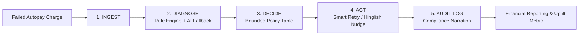

# 🛡️ MandateGuard
### AI Revenue Recovery Agent for Failed UPI Autopay & e-Mandate Charges
**Track**: AI Revenue Recovery — **Razorpay AI Buildathon 2026**

---

## 📌 Executive Summary
Subscriptions and recurring payments in India powered by **UPI Autopay** suffer from recurring debit failures — insufficient balance, expired mandates, bank timeouts, and customer revocations.

Today, most merchants either **blindly retry** on a fixed schedule (wasting NPCI-throttled retry attempts, annoying customers, and risking regulatory penalties) or **do nothing** until the subscriber churns.

**MandateGuard** closes that loop through a fintech-native, **explainable, bounded, and gated** agentic loop:
$$\text{Detect} \longrightarrow \text{Diagnose} \longrightarrow \text{Decide} \longrightarrow \text{Recover} \longrightarrow \text{Measure}$$

---

## 🚀 Key Differentiators & Pitch Proof Points

| Feature | Naive Blind Retry | **MandateGuard Agent** |
| :--- | :--- | :--- |
| **NPCI Attempt Ceiling** | Blindly exhausts retries ($>3\times$) | **Strict 3-attempt ceiling ($0$ violations)** |
| **Mandate Lifecycle Gating** | Retries revoked/expired mandates | **Hard gating: $0$ retries on revoked/expired** |
| **Timing Alignment** | Blind immediate retries ($18\%$ success) | **Smart Salary Window (1st-5th / T+2d: $78\%$ success)** |
| **Expired Mandates** | Dropped / Unrecoverable churn | **1-Click Hinglish WhatsApp Nudge ($52\%$ recovery)** |
| **Explainability** | Black-box / None | **5-Stage regulatory compliance audit trail** |
| **Revenue Uplift** | Baseline | **$+139.6\%$ Net Revenue Uplift** |

---

## 🏗️ Architecture & 5-Stage Agent Loop



### The 3 Distinct AI Capabilities:
1. **AI Diagnostic Classifier**: Interprets unstructured, vendor-specific, or ambiguous bank clearing strings into 6 normalized root causes with calibrated confidence scores.
2. **Hinglish WhatsApp / SMS Nudge Generator**: Generates high-converting, culturally nuanced localized Hinglish recovery messages with 1-click renewal/pay links.
3. **Regulatory Audit Narrator**: Translates mathematical policy rule triggers into plain-English compliance notes for RBI / NPCI regulatory audit readiness.

---

## ⚡ Decision Policy Table (Bounded & Gated Logic)

| Root Cause | Attempt Ceiling | Action Picked | Regulatory Guardrail |
| :--- | :--- | :--- | :--- |
| `insufficient_balance` | $< 3$ attempts | **Smart Retry** (Salary window 1st-5th or T+2d) | Never retry $> 3\times$ per cycle |
| `bank_timeout` | $< 3$ attempts | **Immediate Retry** (T+15m) | Cap retries; if 2 consecutive timeouts $\rightarrow$ escalate |
| `mandate_expired` | Any | **Renewal Nudge** (Hinglish WhatsApp) | Retrying expired mandate is strictly forbidden |
| `mandate_revoked` | Any | **Terminal State** (Win-back only) | Never attempt to charge a revoked mandate |
| `technical_failure` | $< 2$ attempts | **Gateway Retry** (T+1h) | Escalate to engineering after 2 fails |
| `unknown / low conf` | Any | **Escalate to Manual Ops Queue** | Never auto-retry unconfident cases ($<70\%$) |

---

## 💻 Quick Start & Running Locally

### 1. Install & Seed
```bash
# Clone or navigate to the directory
cd mandateguard

# Install and start the backend & frontend
npm run dev
```

The application will start at:
- **Frontend Dashboard**: `http://localhost:5173` (or `http://localhost:3001` in production mode)
- **Backend API**: `http://localhost:3001/api/dashboard/stats`

### 2. CLI Batch Recovery Mode
To run the automated recovery agent over the synthetic dataset directly in your terminal:
```bash
npm run recover
```

### 3. Re-seed Synthetic Dataset
To reset and re-seed 52 realistic UPI Autopay failure records:
```bash
npm run seed
```
